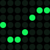
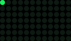
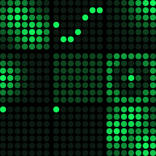

# react-native-dotgrid

<div align="center">




Animated dot-matrix display component for React Native, inspired by [ElevenLabs UI Matrix](https://ui.elevenlabs.io/docs/components/matrix).

[](https://www.npmjs.com/package/react-native-dotgrid)
[](LICENSE)

</div>

## Features

- **Crisp SVG Rendering** - Sharp dots at any size using `react-native-svg`
- **UI Thread Animations** - Smooth 60fps animations via Reanimated
- **VU Meter Mode** - Real-time audio visualization support
- **Customizable** - Full control over colors, sizing, and timing
- **Pre-built Presets** - Wave, loader, pulse, snake, ripple animations
- **Cross-Platform** - iOS, Android, and Web support
- **Accessible** - Screen reader support with ARIA labels

## Showcase

<div align="center">



*Multiple patterns and animations running simultaneously*

</div>

## Installation

```bash
npm install react-native-dotgrid react-native-svg react-native-reanimated
```

### Configuration

Add `react-native-reanimated/plugin` as the **last** plugin in your Babel config:

```js
// babel.config.js
module.exports = {
  presets: ['module:@react-native/babel-preset'],
  plugins: [
    // ... other plugins
    'react-native-reanimated/plugin' // ← Must be last
  ]
};
```

For Expo projects, see [`example/babel.config.js`](example/babel.config.js) for a working setup.

## Quick Start

```tsx
import React from 'react';
import { View } from 'react-native';
import { Matrix, waveFrames, digits } from 'react-native-dotgrid';

export default function App() {
  return (
    <View style={{ flex: 1, alignItems: 'center', justifyContent: 'center' }}>
      {/* Static digit */}
      <Matrix rows={7} cols={5} pattern={digits[5]} />

      {/* Animated wave */}
      <Matrix rows={7} cols={7} frames={waveFrames} fps={20} loop />
    </View>
  );
}
```

## Usage Examples

### Static Patterns

Display a single static pattern:

```tsx
import { Matrix, digits, chevronLeft } from 'react-native-dotgrid';

// Display number 5
<Matrix rows={7} cols={5} pattern={digits[5]} />

// Direction indicator
<Matrix rows={7} cols={7} pattern={chevronLeft()} />
```

### Animated Presets

Use pre-generated animations for common patterns:

```tsx
import { Matrix, waveFrames, loaderFrames, snakeFrames } from 'react-native-dotgrid';

// Wave animation
<Matrix rows={7} cols={7} frames={waveFrames} fps={20} loop />

// Loading spinner
<Matrix rows={7} cols={12} frames={loaderFrames} fps={18} loop />

// Snake with fading tail
<Matrix rows={7} cols={12} frames={snakeFrames} fps={20} loop />
```

### Dynamic Generation

Generate patterns with custom dimensions:

```tsx
import { Matrix, generateWaveFrames, pulse, ripple } from 'react-native-dotgrid';

// Custom wave size
const customWave = generateWaveFrames(10, 10, { length: 30 });
<Matrix rows={10} cols={10} frames={customWave} fps={20} loop />

// Pulse effect
<Matrix rows={8} cols={8} frames={pulse(8, 8, 16)} fps={16} loop />

// Ripple effect with options
const rippleFrames = ripple(9, 9, {
  length: 48,
  wavelength: 3.5,
  damping: 0.06
});
<Matrix rows={9} cols={9} frames={rippleFrames} fps={24} loop />
```

### VU Meter Mode

Create audio visualizations with real-time level updates:

```tsx
import { Matrix } from 'react-native-dotgrid';
import { useEffect, useState } from 'react';

function AudioVisualizer() {
  const [levels, setLevels] = useState(Array(12).fill(0));

  useEffect(() => {
    // Update levels from audio input
    const interval = setInterval(() => {
      setLevels(Array.from({ length: 12 }, () => Math.random()));
    }, 80);
    return () => clearInterval(interval);
  }, []);

  return (
    <Matrix
      rows={7}
      cols={12}
      mode="vu"
      levels={levels}
      palette={{
        on: '#00ff00',
        off: '#003300',
        background: '#000'
      }}
    />
  );
}
```

### Static VU Pattern

Create static VU meter displays using the `vu()` helper:

```tsx
import { Matrix, vu } from 'react-native-dotgrid';

// Display static levels
const levels = [0.2, 0.5, 0.8, 1.0, 0.7, 0.4, 0.1];
<Matrix rows={7} cols={7} pattern={vu(7, levels)} />
```

### Custom Styling

Customize colors, sizing, and spacing:

```tsx
<Matrix
  rows={7}
  cols={7}
  frames={waveFrames}
  size={12}          // Dot diameter in pixels
  gap={3}            // Space between dots
  brightness={0.8}   // Global brightness multiplier
  palette={{
    on: '#00ffff',   // Active dot color
    off: '#001122',  // Inactive dot color
    background: 'transparent'
  }}
  fps={30}
  loop
/>
```

## API Reference

### Matrix Component Props

| Prop | Type | Default | Description |
|------|------|---------|-------------|
| **rows** | `number` | *required* | Number of rows in the grid |
| **cols** | `number` | *required* | Number of columns in the grid |
| **pattern** | `Frame` | - | Single frame to display (static) |
| **frames** | `Frame[]` | - | Array of frames for animation |
| **fps** | `number` | `12` | Animation frames per second |
| **autoplay** | `boolean` | `true` | Start animation on mount |
| **loop** | `boolean` | `true` | Loop animation continuously |
| **paused** | `boolean` | `false` | Pause/resume animation |
| **size** | `number` | `10` | Dot diameter in pixels |
| **gap** | `number` | `2` | Space between dots in pixels |
| **palette** | `Palette` | See below | Color configuration |
| **brightness** | `number` | `1` | Global brightness (0-1) |
| **mode** | `'default' \| 'vu'` | `'default'` | Rendering mode |
| **levels** | `number[]` | - | VU meter levels (0-1) per column |
| **onFrame** | `(index: number) => void` | - | Frame change callback |
| **accessibilityLabel** | `string` | - | Screen reader label |

### Types

```typescript
type Frame = number[][];  // 2D array, values 0-1 (brightness)

type Palette = {
  on: string;         // Active dot color
  off: string;        // Inactive dot color
  background?: string; // Optional background
};
```

### Pre-generated Constants

All pre-generated at 7×7 dimensions for consistency:

- **`digits`** - Array of 10 digit patterns (0-9), each 7×5
- **`waveFrames`** - 24-frame sine wave animation
- **`loaderFrames`** - Perimeter loading spinner
- **`pulseFrames`** - 16-frame global brightness pulse
- **`snakeFrames`** - 49-frame snake with fading tail
- **`rippleFrames`** - 24-frame concentric ripple effect
- **`chevronLeftFrame`** - Static left arrow
- **`chevronRightFrame`** - Static right arrow

### Generator Functions

Create patterns at any dimensions:

```typescript
// Animations
generateWaveFrames(rows, cols, options?)
generateLoaderFrames(rows, cols)
generatePulseFrames(rows, cols, frameCount?)
generateSnakeFrames(rows, cols, tailLength?)
generateRippleFrames(rows, cols, options?)

// Static patterns
chevronLeft(rows?, cols?)
chevronRight(rows?, cols?)
vu(cols, levels)
empty(rows, cols)

// Convenience aliases
wave(rows, cols)     // → generateWaveFrames
loader(rows, cols)   // → generateLoaderFrames
pulse(rows, cols)    // → generatePulseFrames
snake(rows, cols)    // → generateSnakeFrames
ripple(rows, cols)   // → generateRippleFrames
```

## Performance

- **Memoized Grid** - Dot positions calculated once and cached
- **UI Thread** - Animations run on the UI thread via Reanimated
- **Optimized Rendering** - Only opacity animates, positions are static
- **SVG Benefits** - Resolution-independent, crisp at any size

## Web Support

This library works on web via `react-native-web`. For Expo web:

```json
// app.json
{
  "expo": {
    "web": {
      "bundler": "metro"
    }
  }
}
```

## Demo Generation

Generate the GIF/WebP animations seen in this README:

```bash
npm run generate:demos
```

This creates optimized GIF and WebP animations in the `demos/` directory using the actual frame data from the presets. You can generate specific formats using `--gif` or `--webp` flags.

## Acknowledgments

This library is inspired by the [Matrix component from ElevenLabs UI](https://ui.elevenlabs.io/docs/components/matrix), reimagined for React Native with cross-platform support and additional animation capabilities.

## Contributing

Contributions are welcome! Please feel free to submit a Pull Request.

## License

MIT © Tristan Manchester

---

<div align="center">
Made with ❤️ for the React Native community
</div>
